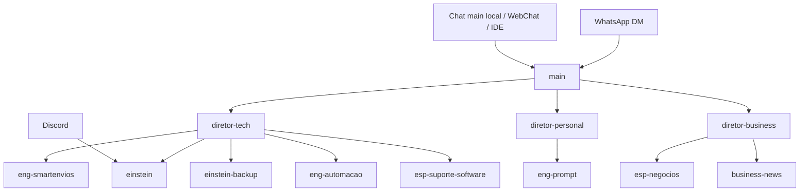

# OpenClaw Operating Contract

**Status:** espelho humano do contrato executavel em `workspace/docs/OPENCLAW-OPERATING-CONTRACT.json`
**Objetivo:** garantir que todas as superficies de IA usem a mesma compreensao logica do OpenClaw, com a mesma hierarquia, a mesma semantica de implementacao e o mesmo protocolo de expansao do sistema.

## 1. Fonte de verdade

Fonte unica executavel:
- `workspace/docs/OPENCLAW-OPERATING-CONTRACT.json` define a topologia oficial, perfis de contexto, superficies, protocolo de expansao e contrato minimo de cron.
- `openclaw.json#agents.list` define os agentes registrados no runtime.
- `openclaw.json#bindings` define bindings efetivos de canal quando o gateway precisa de roteamento explicito.

Este documento e a leitura humana desse contrato. Ele nao deve criar regra concorrente nem registrar agente que nao exista no contrato executavel.

Hierarquia de documentos:
1. `workspace/docs/OPENCLAW-OPERATING-CONTRACT.json` e a fonte executavel do contrato operacional comum.
2. `workspace/docs/OPENCLAW-OPERATING-CONTRACT.md` e o espelho humano do contrato.
3. `workspace/FLUXO_AGENTES.md` detalha a cadeia Notion e o lifecycle operacional.
4. `workspace/templates/agent-behavior-patterns.md` define os padroes transversais de execucao.
5. `workspace/AGENTS.md` e `workspace/agents/*/AGENTS.md` funcionam como delta por superficie/papel.
6. `workspace/SETUP_COMPLETO.md` e `workspace/TOOLS.md` sao documentos derivados e nao devem competir com os itens acima.

Regra obrigatoria:
- se um Markdown divergir de `workspace/docs/OPENCLAW-OPERATING-CONTRACT.json`, corrigir o Markdown ou atualizar o contrato executavel explicitamente; nao criar interpretacao local alternativa.
- se `agents.list`, `bindings` ou `cron/jobs.json` divergir do contrato executavel, tratar como drift operacional e abrir correcao antes de expandir o sistema.

## 2. Topologia oficial do sistema

### 2.1 Agentes registrados no runtime

Os agentes hoje registrados no `openclaw.json` sao:
- `main`
- `eng-smartenvios`
- `eng-prompt`
- `einstein`
- `einstein-backup`
- `eng-automacao`
- `esp-negocios`
- `business-news`
- `esp-suporte-software`

Cada agente oficial deve ter no contrato executavel:
- `agentId`
- `role`
- `reportsTo`
- `domain`
- `channelEntrypoint`
- `workspace`
- `notionDb`
- `promptProfile`
- `status`
- `backupOf`, quando for contingencia.

Pastas locais, prompts soltos ou rotinas em `workspace/scripts/` nao criam agente oficial sem esse registro.

### 2.2 Hierarquia canonica

- `main` e o orquestrador principal do sistema.
- `diretor-tech`, `diretor-personal` e `diretor-business` sao papeis canonicos de triagem e delegacao.
- `eng-smartenvios`, `einstein`, `eng-automacao` e `esp-suporte-software` pertencem ao dominio `tech`.
- `eng-prompt` pertence ao dominio `personal/governance`.
- `esp-negocios` pertence ao dominio `business`.
- `business-news` pertence ao dominio `business/intelligence`.
- `einstein-backup` e contingencia de `einstein`, nao um especialista paralelo de primeiro nivel.
- `mail-pro`, `mail-person`, `governanca` e `otimizador` sao rotinas canonicas do fluxo Notion/cron, nao agentes de conversa livre no runtime.

Regra de transicao:
- enquanto os diretores nao estiverem registrados como agentes formais no runtime, eles continuam existindo como papeis canonicos do sistema e devem ser respeitados por todas as superficies de IA.

## 3. Superficies e semantica compartilhada

Todas as superficies abaixo devem falar a mesma lingua de projeto:
- chat local `http://127.0.0.1:18789/chat?session=main`
- WhatsApp
- Discord
- WebChat
- Cursor
- VS Code
- Codex
- Claude Code

A matriz oficial de superficie vive em `workspace/docs/OPENCLAW-OPERATING-CONTRACT.json#surfaceMatrix`.

### 3.1 Regra-mestra

A superficie pode mudar, mas nao pode mudar:
- a leitura de hierarquia;
- a compreensao do mapa de agentes;
- a definicao de quem implementa o que;
- a semantica de delegacao;
- o protocolo de criacao de novos agentes;
- a distincao entre mudanca estrutural, rotina operacional e execucao pontual.

### 3.2 O que pode variar por superficie

Pode variar apenas:
- formato de resposta;
- ferramentas disponiveis;
- capacidade de entrega publica;
- capacidade de execucao local;
- nivel de detalhe operacional adequado ao canal.

## 4. Perfis de contexto

Os perfis canonicos do OpenClaw sao definidos em `workspace/docs/OPENCLAW-OPERATING-CONTRACT.json#contextProfiles`:

### `interactive-main`
- usado pelo `main` em chat local, WebChat e interfaces de desenvolvimento;
- pode carregar contexto estrategico e explicativo;
- deve seguir a mesma logica de hierarquia e governanca do sistema.

### `interactive-support`
- usado em superficies de suporte e atendimento, especialmente `einstein`;
- prioriza objetividade, evidencias e acao imediata;
- nao pode reinterpretar a topologia do sistema.

### `deterministic-cron`
- usado por jobs operacionais isolados;
- deve carregar contexto minimo;
- executa comando explicito e usa JSON/script como fonte de verdade.

### `heartbeat`
- usado para verificacoes curtas e recorrentes;
- contexto minimo e formato altamente controlado.

Regra:
- nenhuma superficie pode criar um perfil extra sem registrar isso neste contrato.
- nenhum cron deve carregar perfil interativo quando o trabalho for comando deterministico.

## 4.1 Contrato minimo para crons

O contrato executavel para crons vive em `workspace/docs/OPENCLAW-OPERATING-CONTRACT.json#cronPayloadContract`.

Todo job deterministico deve convergir para:
- `agentId`
- `promptProfile`
- `command`
- `outputContract`
- `policyVersion`

Regra de transicao:
- `cron/jobs.json` pode manter `payload.message` durante compatibilidade, mas esse texto nao deve carregar hierarquia, topologia ou regras longas que ja vivem no contrato central;
- a fase de enxugamento deve reduzir cada job para comando explicito + contrato de saida estruturado;
- o JSON ou saida estruturada do script e a fonte de verdade da rodada.

## 5. Protocolo de criacao e evolucao de agentes

Nenhuma interface de IA pode criar, assumir ou operar um novo agente sem passar por este protocolo.

O protocolo executavel vive em `workspace/docs/OPENCLAW-OPERATING-CONTRACT.json#agentExpansionProtocol`.

Toda proposta de novo agente deve responder explicitamente:
1. `agentId`
2. `papel`
3. `reportsTo`
4. `domain`
5. `channelEntrypoint`
6. `workspace`
7. `notionDb` ou justificativa para nao usar Notion
8. `promptProfile`
9. `criterioDeExistencia`
10. `diferenca` para um agente ja existente

Regras obrigatorias:
- se o papel puder ser absorvido por um agente existente, nao criar novo agente;
- se a proposta for apenas uma rotina nova, criar rotina e nao agente;
- se a proposta for apenas um novo canal, registrar como nova superficie, nao como novo agente;
- se a proposta exigir novo agente, ele so passa a existir de facto quando for refletido no mapa central e no runtime aplicavel.
- nenhuma IDE, chat local, WhatsApp, Discord ou WebChat pode pular essa classificacao por estar em outro envelope de interacao.

## 6. Status de registro estrutural

### `registered`
- existe no `openclaw.json` ou em runtime equivalente oficialmente adotado.

### `canonical-role`
- papel reconhecido como parte do sistema, mesmo que ainda nao seja um agente formal no runtime.

### `backup`
- agente de contingencia vinculado a outro agente principal.

### `draft`
- artefato em workspace, documento ou prompt que ainda nao foi aprovado como parte oficial da topologia.

Regra:
- arquivos locais, pastas em `workspace/agents/` ou prompts soltos nao criam automaticamente um agente oficial.

## 7. Caso atual: Business-News

Existe hoje um artefato local em `workspace/agents/business-news/`, com `AGENTS.md` proprio e rotina ativa em `workspace/scripts/business-news-simple.sh`.

Status atual deste artefato:
- `registered`

Motivo:
- esta registrado no `openclaw.json`;
- foi posicionado formalmente como especialista de inteligencia sob `diretor-business`;
- opera com `promptProfile = deterministic-cron`;
- seu canal de entrega atual e `WhatsApp`, com entrada por cron.

Regra de interpretacao:
- toda interface deve tratar `business-news` como agente oficial de briefing recorrente de negocios, nao como agente generalista de conversa livre.

## 8. Regras de governanca conversacional

Antes de sugerir qualquer mudanca estrutural, toda superficie deve classificar a demanda como uma destas categorias:
- ajuste num agente existente;
- nova rotina de um agente existente;
- nova superficie/canal;
- novo papel canonico;
- novo agente oficial;
- artefato experimental ainda nao registrado.

Pergunta obrigatoria antes de expandir o sistema:
- isto aumenta poder estrutural real ou apenas cria mais uma entidade para gerir?

## 9. Regras de manutencao

Ao mudar a topologia, deve-se refletir o delta nos seguintes pontos:
- `workspace/docs/OPENCLAW-OPERATING-CONTRACT.json`;
- `openclaw.json#agents.list` e `openclaw.json#bindings`, quando houver efeito de runtime;
- `workspace/FLUXO_AGENTES.md`, quando houver impacto no pipeline Notion;
- `workspace/AGENTS.md` e `workspace/agents/*/AGENTS.md`, apenas no delta aplicavel;
- `workspace/SETUP_COMPLETO.md` e `workspace/TOOLS.md`, como documentacao derivada.

## 10. Resultado esperado

Quando este contrato estiver sendo respeitado:
- o `main` local, WhatsApp, Discord e IDEs interpretarao o mesmo OpenClaw;
- nenhuma interface criara um “OpenClaw paralelo”;
- novos agentes so surgirao por governanca explicita;
- throughput aumenta porque o sistema deixa de reaprender a propria estrutura a cada superficie.
